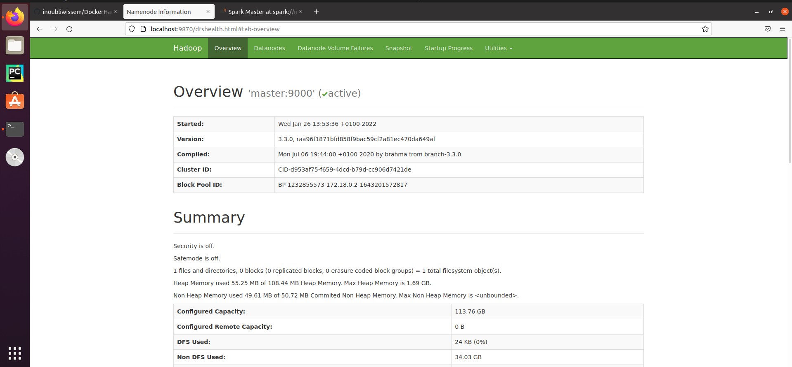
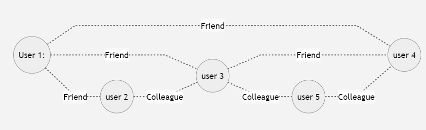

# BigDataLab4TalTech
# Hands-on on big data frameworks
In this lab session, we'll be setting up and configuring both Apache Hadoop and Spark on a virtual cluster of machines using container technology (specifically Docker in our case). Our aim is to delve into the distributed file system provided by Apache Hadoop (HDFS) and explore the distributed processing framework of MapReduce implemented by Hadoop. Moving forward, we'll dive into Apache Spark, experimenting with several examples.
The diagram below showcases the architecture that will be deployed for this lab.


### Requirements

 - Docker engine installed (https://docs.docker.com/engine/install/ubuntu/)
 - Basic knowledge on container technologies and docker 
 - Git installed (to get the docker image otherwise you can download the zip file directly)

# I. Configuration
 
 1. **Clone the GitHub repository and generate the image by utilizing the Dockerfile located within the repository.**
```
$git clone https://github.com/inoubliwissem/BigDataLab4TalTech.git
$cd BigDataLab4TalTech
$docker build -t node-sh .
```  
 If you want to confirm the creation of this image, you can review all created images by executing the following command line::
 ```
$docker images
```
 2. **Create a virtual network that connects the machines (master and slaves)**
 ```
$docker --driver bridge cluster (docker network create cluster for mac users)
```
 3. **Instantiate containers from the generated Docker image, one serving as the master and another as a slave machine.**  

 ```
$docker run -it --name master -p 7077:7077 -p 8080:8080 -p 9870:9870 -p 8088:8088 --hostname master --network cluster node-sh bash 
```

 ```
$docker run -it --name slave1  --hostname slave1 --network cluster node-sh bash 
```
To view the initiated services on each machine, we suggest opening a terminal for each respective image.

4.  **Start the ssh service (in both machines) and install the text editor nano**
 ```
 huser@master$ sudo service  ssh start
 huser@master$ sudo apt-get install nano
```
 5.  **Edit configuration files in both containers (master and slave)** 
	
 **1. Hadoop**  
 
1.1 Edit the *core-site.xml* file and add the current machine as a master machine, the default value is lacalhost you shoud replace it by master in our case.

```
hduser@master$nano /home/hduser/hadoop/etc/hadoop/core-site.xml
```  
    
   1.2 Edit the *workers* file in order to add the slave machines (in our case we will take all machines as slaves, in the *workers* file we will add two lines (*master, slave1*)
```
  hduser@master$ nano /home/hduser/hadoop/etc/hadoop/workers
```  
 1.3 Copy the hadoop folder from the master to all slaves.  	
 ```
 hduser@master$scp -r hadoop hduser@slave1:/home/hduser/
```      
1.4 Format the namenode 
   ```
 hduser@master$hdfs namenode -format
```
1.5 Start hadoop 's services (YARN and HDFS)
```
 hduser@master$start-all.sh
```
1.6 Check the started services: 
At the master machine we will see the following services:
```
 hduser@master$jps
 NodeManager
 DataNode
 resourceManager
 NameNode
 SecondaryNamenode
 jps
``` 
At the slave machines we will see the following services:
```
 hduser@master$jps
 NodeManager
 DataNode
 jps
``` 
**2. Spark**
2.1 Rename and edit the *spark-defaults.conf.template* file
```
hduser@master$ cp /home/hduser/spark/conf/spark-defaults.conf.template /home/hduser/spark/conf/spark-defaults.conf
hduser@master$ echo "spark.master   spark://master:7077" >> /home/hduser/spark/conf/spark-defaults.conf
```
2.2 Rename and edit the *workers.template* file
```
hduser@master$ cp /home/hduser/spark/conf/workers.template /home/hduser/spark/conf/workers
hduser@master$ echo "master" > /home/hduser/spark/conf/workers
hduser@master$ echo  "slave1" >> /home/hduser/spark/conf/workers
```
2.3 Copy the spark folder from the master to all slaves.
 ```
 hduser@master$scp -r spark hduser@slave1:/home/hduser/
``` 
2.4    Start Spark's services (Master and worker)
 ```
 hduser@master$./spark/sbin/start-all.sh
``` 
1.6 Check the started services: 
At the master machine we will see the following services:
```
 hduser@master$jps
 NodeManager
 DataNode
 resourceManager
 NameNode
 SecondaryNamenode
 jps
 **Master**
 **worker**
``` 
At the slave machines we will see the following services:
```
 hduser@master$jps
 NodeManager
 DataNode
 **worker**
 jps
``` 
6. Web interfaces
When all services (hadoop and spark) are started, we can check  their provided graphic web interface. 
**Hadoop HDFS GUI**


**Spark GUI**  


# II. Usage and manipulation of the big data platforms  

## 1. Hadoop
#### 1.1 HDFS:  
>In this section we will use and apply some HDFS command in order to manipulate and manage the distributed file system.

 - Create a folder in HDFS
  ```
 hduser@master$hdfs dfs -mkdir /taltech 
``` 
- Check the creation of the ***taltech***  folder
 ```
 hduser@master$hdfs dfs -ls  /
``` 
- Copy files from the local FS to the HDFS
 ```
 hduser@master$hdfs dfs -put /home/hduser/hadoop/README.txt /taltech/
``` 
OR 
 ```
 hduser@master$hdfs dfs -copyFromLocal /home/hduser/hadoop/README.txt /taltech/
``` 
- Copy files from the ***HDFS*** to the local FS 
 ```
 hduser@master$hdfs dfs -get /taltech/README.txt /home/hduser/hadoop/README2.txt 
``` 
- Print the last *5* number of lines of the given input file (in the HDFS)
 ```
 hduser@master$hdfs dfs -tail -s 5 /taltech/README.txt 
``` 
- Print the first lines of the given input file (in the HDFS)
 ```
 hduser@master$hdfs dfs -head /taltech/README.txt 
``` 
> If you what to use or see other HDFS commands, use this command (***hdfs dfs*** ) to show all available commands.
#### 1.2 YARN:  
 - Run or submit a mapreduce job
  ```
 hduser@master$yarn jar /home/hduser/hadoop/share/hadoop/mapreduce/hadoop-mapreduce-examples-3.2.0.jar wordcount /taltech/README.txt /taltech/rst 
``` 
 - Get list of applications on the cluster
  ```
 hduser@master$yarn app -list 
``` 
- Kill an application 
 ```
 hduser@master$yarn app -kill *AppID*
``` 
- Print the list of machines in the cluster
 ```
 hduser@master$yarn node -node
``` 
> To see more commands, you can check this link: https://hadoop.apache.org/docs/stable/hadoop-yarn/hadoop-yarn-site/YarnCommands.html
## 2. Spark
#### 2.1 Interactive mode:  
In this section spark-shell will be used to manipulate the RDDs and DataFrames on top of spark engine.
 - Start the spark 's interactive shell
 ```
 hduser@master$./spark/bin/spark-shell 
``` 
> when we start the interactive shell two objects will be created that can be used in our examples. Those object are the sparkContext object (sc used by the RDDS)  and SparkSession object (spark that will be used in the DataFrame part)
 - Create an RDD from and existing file
 ```
 scala>val rdd1=sc.textFile("/home/hduser/hadoop/README.txt")
``` 
 - Create an RDD from an HDFS file
 ```
 scala>val rdd2=sc.textFile("hdfs://master:9000/taltech/README.txt")
```
> Here we should check that the 8020 is opened 
  - Apply an action on an existing RDD
 ```
 scala> rdd1.count()
```
  **DataFrame**
> In this sub-section we will use the second data structure proposed by Spark (spark SQL)
> A DataFrame is a data structure that organizes the data as a matrix where the columns are the attributes and the lines are the instances.


| Project | Nb-Of-Contributors |
|---------|--------------------------|
| Hadoop  | 425                |
| Spark   | 1772               |
| Storm   | 343                |
| Kafka   | 849                |
| Flink   | 1004               |

 - Put the meta-data of the DataFrame as a list
 ```
 scala>val columns=Seq("project","Nb-Of-Contributors")
``` 
 - Put the data of the DataFrame as a list
  ```
 scala>val data=Seq(("Hadoop",425),("Spark",1772),("Storm",343),("Kafka",849),("Flink",1004))
``` 
 - Create a DataFrame 
  ```
 scala>val dataframe=spark.createDataFrame(data).toDF(columns:_*)
``` 
 - Print the schema of the created dataframe
  ```
 scala> dataframe.printSchema()
``` 
 - Print the content of the created dataframe
 ```
 scala> dataframe.show()
``` 
 - Read a csv file into Spark DataFrame
 ```
 scala> val df = spark.read.option("header",true).csv("flight.csv")
``` 

 - Show the df structure or meta-data
 ```
 scala> df.printSchema()
``` 

 - Select only  "DAY and DAY_OF_WEEK" columns from the DF
 ```
 scala> df.select("DAY","DAY_OF_WEEK").show()
``` 

 - Apply filter on DF
 ```
 scala> df.filter($"DAY_OF_WEEK" >2).show()
``` 

 - Apply filter and projection on DF at the same time
 ```
 scala> df.filter($"DAY_OF_WEEK" >2).select("DAY","DAY_OF_WEEK").show()
``` 

 - Apply an aggregation on DF
 ```
 scala> df.groupBy("DAY").count().show()
``` 

 - Use SQL on DF
 ```
 scala> df.createOrReplaceTempView("flights")
 scala> val sqlDF = spark.sql("SELECT DAY FROM flights")
``` 
 **Graphs with Spark GraphX** 
> GraphX is a useful library provided by spark for the graph data structure. In this sub-section we will use this library  to manipulate graphs.  The next figure shows a graph and using GraphX we will create it.


```
mermaid
graph LR
A((User 1:))-.Friend.-B((user 2))
A((User 1:))-.Friend.-C((user 3))
A((User 1:))-.Friend.-D((user 4))
B -.Colleague.- C
C -.Colleague.-F((user 5))
C -.Friend.- D
F -.Colleague.- D
```


 -  Import classes
 ```
 scala>import org.apache.spark.graphx.Edge
 scala>mport org.apache.spark.graphx.Graph
 scala>mport org.apache.spark.graphx.lib._
```   
-  Creating the property graph
 ```
 scala> val verticesArray = Array(
 (1L, ("user1")),
 (2L, ("user2")),
 (3L, ("user3")),
 (4L, ("user4")),
 (5L, ("user5")))
```  
 ```
 scala> val edgeArray = Array(
 Edge(1L, 2L,"Friend"),
 Edge(1L, 3L, "Friend"), 
 Edge(1L, 3L, "Friend"),
 Edge(2L, 3L, "Colleague"),
 Edge(3L, 4L, "Colleague"),
 Edge(3L, 5L, "Colleague"),
 Edge(4L, 5L, "Colleague"))
```  
-  Create RDDs from the vertices and edges arrays by using the *sc.parallelize()* function
 ```
scala> val verticesRDD = sc.parallelize(verticesArray )
scala> val edgesRDD = sc.parallelize(edgeArray )
```  
-  Graph building
 ```
val graph = Graph(verticesRDD , edgesRDD )
```  
#### 2.2 Submit a job on a cluster Spark
 ```
hduser@master$./spark/bin/spark-submit --class org.apache.spark.examples.SparkPi --master spark://master:7077 /home/hduser/spark/examples/jars/spark-examples_2.12-3.2.1.jar 100
```
