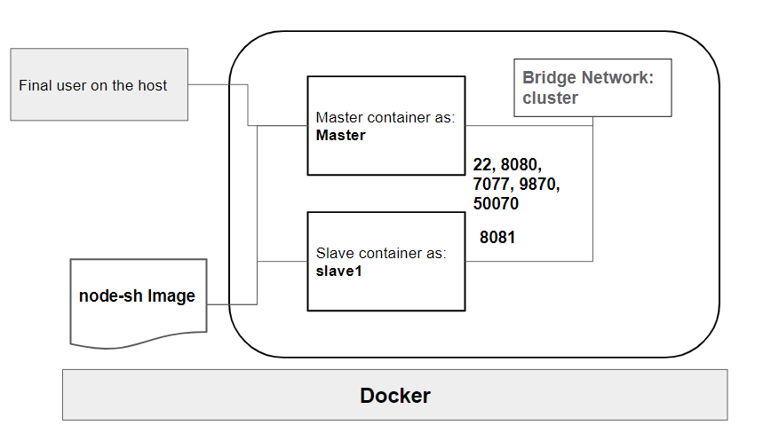

# Hadoop-spark cluster on Docker

This is an example of how to run a Hadoop-spark cluster on Docker. The following picture shows the architecture of the cluster.


## Prerequisites

- Docker engine
- Docker compose

## How to run

- Clone the repository
- Run the following command to start the cluster

```shell
cd BigDataAnalytics
docker build -t hadoop-spark .
docker-compose up -d
```

This will start the nodes and creates a bridge network called `hadoop-spark-net`. The nodes will be accessible through the following hostname:

- 'master'
- 'worker1'

Also it starts the ssh server on each of the nodes, and the hadoop and spark services.

## How to use

- To access the master node, run the following command

```shell
docker exec -it master bash
```

- To check the started services, run the following command

```shell
hduser@master$jps
 NodeManager
 DataNode
 resourceManager
 NameNode
 SecondaryNamenode
 jps
 **Master**
 **worker**
```

- At the worker nodes, we can see the following services

```shell
 hduser@master$jps
 NodeManager
 DataNode
 **worker**
 jps
```

## Web UI

- Hadoop web UI: <http://localhost:9870>
- Spark web UI: <http://localhost:8080>

## HDFS

- To create a directory in HDFS, run the following command

```shell
hduser@master$hdfs dfs -mkdir /taltech
```

- To copy a file from local file system to HDFS, run the following command

```shell
hduser@master$hdfs dfs -put /home/hduser/README.md /taltech
```

- To copy a file from HDFS to local file system, run the following command

```shell
hduser@master$hdfs dfs -get /taltech/README.md /home/hduser/README2.md
```

- To list the files in HDFS, run the following command

```shell
hduser@master$hdfs dfs -ls /taltech
```

## YARN

- To run a spark job, run the following command

```shell
hduser@master$yarn jar /home/hduser/hadoop/share/hadoop/mapreduce/hadoop-mapreduce-examples-3.3.2.jar wordcount /taltech/README.txt /taltech/rst 
```

- To check the status of the job, run the following command

```shell
hduser@master$yarn app -list
```

- Kill an application

```shell
hduser@master$yarn app -kill *ID*
```

- Print the node list

```shell
hduser@master$yarn node -list
```

## Spark

- To start an interactive pyspark shell, run the following command

```shell
hduser@master$pyspark
```

- Create and RDD from a file

```python
rdd = sc.textFile("/home/hduser/README.md")
```

- Create from a hdfs file

```python
rdd = sc.textFile("hdfs://master:9000/taltech/README.txt")
```

- Count the number of lines

```python
rdd.count()
```

- Dataframe from list

```python
df = spark.createDataFrame([("a", 1), ("b", 2), ("c", 3)], ["letter", "number"])
```

- Schema of the dataframe

```python
df.printSchema()
```

- Show the dataframe

```python
df.show()
```

- Create a dataframe from a csv file

```python
df = spark.read.csv('/home/hduser/flight.csv', header=True)
```
